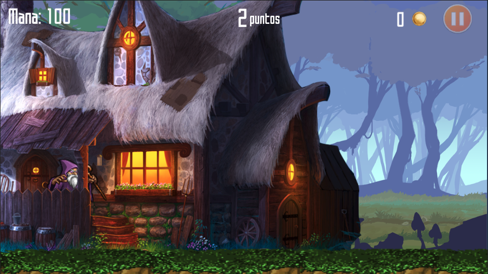

# WizardTales

Game developed to higher studies final project to be executed in Android and Web environments. We implemented an infinite map using a procedural generation of the map, manage of skins and random generation of enemies with different movement behaviours. 

## Screenshot

  

## Version
The game was developed in Unity 5, the upgrade code are update to 2022 version. 
